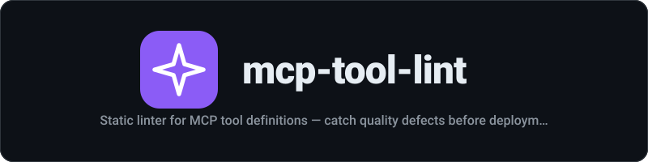

<div align="center">
  
</div>

<p align="center"><strong>Static linter for MCP tool definitions — catch quality defects before deployment</strong></p>

<p align="center">
  <a href="https://github.com/mstuart/mcp-tool-lint/actions/workflows/ci.yml"></a>
  <a href="https://www.npmjs.com/package/mcp-tool-lint"></a>
  
</p>

---
Static linter for [MCP (Model Context Protocol)](https://modelcontextprotocol.io) tool definitions. Catches quality defects before deployment so AI agents use your tools correctly.

A February 2026 research paper analyzing 1,899 MCP tools from 200 servers found that **97.1% have at least one quality defect** -- unclear descriptions, missing parameter documentation, vague naming, and more. These defects cause AI agents to misuse tools, leading to failed actions and poor user experiences.

`mcp-tool-lint` catches these issues statically, before your tools reach production.

## Install

```bash
npm install mcp-tool-lint
```

## Quick Start

### CLI

```bash
# Lint a JSON file of tool definitions
npx mcp-tool-lint tools.json
```

The JSON file should contain a single tool object or an array of tool objects:

```json
[
  {
    "name": "get_user",
    "description": "Retrieves a user by their unique identifier from the database",
    "inputSchema": {
      "type": "object",
      "properties": {
        "userId": { "type": "string", "description": "The unique user ID" }
      },
      "required": ["userId"]
    }
  }
]
```

Output:

```
✓ get_user (0 issues)
```

### Programmatic API

```typescript
import { lintTools, validateTools } from 'mcp-tool-lint';

const tools = [
  {
    name: 'get_data',
    description: 'gets data',
    inputSchema: {
      type: 'object',
      properties: {
        id: { type: 'string' },
      },
    },
  },
];

// Get detailed results
const results = lintTools(tools);
for (const result of results) {
  console.log(`${result.tool}: ${result.passed ? 'PASSED' : 'FAILED'}`);
  for (const issue of result.issues) {
    console.log(`  [${issue.severity}] ${issue.rule}: ${issue.message}`);
  }
}

// Quick pass/fail check (true if no error-severity issues)
const ok = validateTools(tools);
```

## Rules

### `description-length`

**Severity:** warn (error if under 10 characters)

Tool descriptions must be at least 20 characters. Descriptions under 10 characters are flagged as errors.

| Status | Example |
|--------|---------|
| Pass | `"Searches the product catalog by keyword and returns matching items"` |
| Warn | `"Gets user data"` (15 chars) |
| Error | `"Get data"` (8 chars) |

### `require-param-descriptions`

**Severity:** warn

Every property in `inputSchema.properties` should have a `description` field. Without descriptions, AI agents must guess what values to pass.

| Status | Example |
|--------|---------|
| Pass | `{ "userId": { "type": "string", "description": "The unique user ID" } }` |
| Fail | `{ "userId": { "type": "string" } }` |

### `no-vague-verbs`

**Severity:** warn

Descriptions should not start with or prominently use vague verbs. The following are flagged:

- "does", "handles", "manages", "works with", "interacts with", "deals with", "takes care of", "is responsible for", "processes"

Use specific verbs like: creates, returns, searches, deletes, updates, fetches, sends, validates, transforms, filters.

| Status | Example |
|--------|---------|
| Pass | `"Creates a payment record in the billing system"` |
| Fail | `"Handles payments for the checkout flow"` |

### `require-required-array`

**Severity:** warn

If `inputSchema.properties` has entries, `inputSchema.required` should be present (even if empty `[]`) to make intent explicit. Without it, consumers cannot distinguish "all optional" from "the author forgot."

| Status | Example |
|--------|---------|
| Pass | `{ "properties": { "id": ... }, "required": ["id"] }` |
| Pass | `{ "properties": { "id": ... }, "required": [] }` |
| Fail | `{ "properties": { "id": ... } }` (no required field) |

### `description-has-verb`

**Severity:** warn

Descriptions should contain at least one action verb to convey what the tool does. Checked against a list of 200+ common action verbs.

| Status | Example |
|--------|---------|
| Pass | `"Creates a new user account"` |
| Fail | `"A utility for user data in the system"` |

### `no-duplicate-names`

**Severity:** error

When linting multiple tools, no two tools should have the same `name`. Duplicate names cause ambiguity for AI agents selecting tools.

| Status | Example |
|--------|---------|
| Pass | Tools named `get_user`, `create_user`, `delete_user` |
| Fail | Two tools both named `get_user` |

## CLI Usage

```bash
# Basic usage
npx mcp-tool-lint tools.json

# Show help
npx mcp-tool-lint --help

# Show version
npx mcp-tool-lint --version
```

Exit codes:
- `0` -- all tools pass (warnings are OK)
- `1` -- at least one tool has an error-severity issue

Output format:

```
✗ get_data (2 issues)
  warn  [description-length] Description is too short (8 chars, min 20)
  warn  [require-param-descriptions] Parameter 'id' has no description
✓ create_user (0 issues)
```

## Custom Rules

You can pass custom rules to `lintTools`:

```typescript
import { lintTools, Rule, McpToolDefinition, LintIssue } from 'mcp-tool-lint';

const noUnderscores: Rule = {
  name: 'no-underscores-in-name',
  description: 'Tool names should use camelCase, not snake_case',
  check(tool: McpToolDefinition): LintIssue[] {
    if (tool.name.includes('_')) {
      return [{
        rule: 'no-underscores-in-name',
        severity: 'warn',
        message: `Tool name "${tool.name}" uses underscores; consider camelCase`,
        tool: tool.name,
        field: 'name',
      }];
    }
    return [];
  },
};

const results = lintTools(tools, { rules: [noUnderscores] });
```

You can also override severity for built-in rules:

```typescript
const results = lintTools(tools, {
  severity: {
    'description-length': 'error',      // Upgrade to error
    'require-param-descriptions': 'info', // Downgrade to info
  },
});
```

## API Reference

### `lintTool(tool, opts?)`

Lint a single tool definition. Returns a `LintResult`.

### `lintTools(tools, opts?)`

Lint an array of tool definitions. Returns `LintResult[]`. Cross-tool rules (like `no-duplicate-names`) operate across the full set.

### `validateTools(tools, opts?)`

Convenience function. Returns `true` if all tools pass (no error-severity issues).

### Types

```typescript
interface McpToolDefinition {
  name: string;
  description: string;
  inputSchema: {
    type: 'object';
    properties?: Record<string, { type?: string; description?: string; [key: string]: unknown }>;
    required?: string[];
  };
}

type Severity = 'error' | 'warn' | 'info';

interface LintIssue {
  rule: string;
  severity: Severity;
  message: string;
  tool: string;
  field?: string;
}

interface LintResult {
  tool: string;
  issues: LintIssue[];
  passed: boolean; // true if no 'error' severity issues
}

interface Rule {
  name: string;
  description: string;
  check(tool: McpToolDefinition, allTools?: McpToolDefinition[]): LintIssue[];
}
```

## License

MIT
